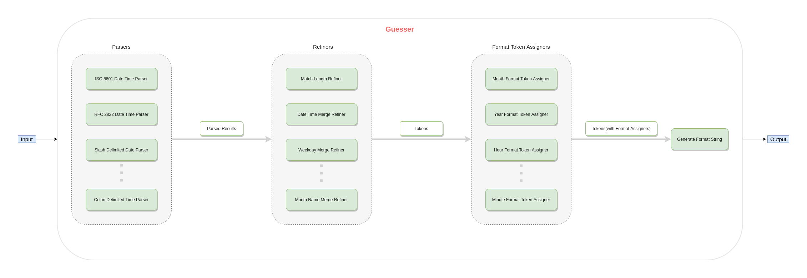

<h1 align="center">Welcome to moment-guess 👋<br> </h1>
<p>
  
  <a href="https://github.com/apoorv-mishra/moment-guess#readme" target="_blank">
    
  </a>
  <a href="https://github.com/apoorv-mishra/moment-guess/graphs/commit-activity" target="_blank">
    
  </a>
  <a href="https://github.com/apoorv-mishra/moment-guess/blob/master/LICENSE" target="_blank">
    
  </a>
</p>

> :tada: A utility package for guessing date's format :alarm_clock: :raised_hands:


<h2 align="center"><em>Warning</em>: Work in progress ahead! 🚧</h3>

## 👨‍💻 Usage
```sh
npx moment-guess --help
```
## 🙌 Supported Formats
- *2020-07-24T17:09:03+00:00*([IS0 8601](https://en.wikipedia.org/wiki/ISO_8601))

- *Mon, 06 Mar 2017 21:22:23 +0000*([RFC 2822](https://tools.ietf.org/html/rfc2822#section-3.3))

- *31/12/2020, 1.1.2020, 31-12-20*(slash, dot or dash delimited dates, both US and UK styles)

- *Fri, January 30th 2020*(dow, dd Mon yyyy with both short and long names)

## 🤷‍♀️ What happens in case of ambiguous input?
If the input is ambiguous like 01/01/2020(could mean DD/MM/YYYY or MM/DD/YYYY), **it would display all possible matched formats**. Try `npx -q moment-guess -d '01/01/2020'`

## :thinking: Motivation

**PM**: *Hey, could you please display date on the rightmost part of the row in a format similar to Fri, 6th March 2020, 10:00 AM?*

**Me**: *Sure. (types on screen ... moment(timestampFromDB).format(// Uh Oh!, what should I put here?))*

**Methinks**: *Hmm...such requirements pop up once in a while, not everyday(at least for me). And everytime it happens, I end up sifting through momentjs docs [here](https://momentjs.com/docs/#/displaying/) to choose the right format tokens in order to display date in the desired format("ddd, Do MMMM YYYY, hh:mm A" in this case). Can this be avoided? Is it possible to guess a date's format from the desired date value itself?*

## :hammer: Run tests

```sh
npm run test
```

## :mag: How does it work?


Entire module is split up into three main components, _parsers_, _refiners_ and _assigners_.

* _Parsers_ break the input into individual tokens, giving meaning to each token(whether it's year, month, day...).

* _Refiners_ refine the parsed results based on certain chosen heuristics in case the input matched multiple parsers.

* _Assigners_ assign the appropriate format tokens(don't confuse these with generated tokens from input) enlisted [here](https://momentjs.com/docs/#/displaying/) to each corresponding token based on the meaning given to the token by the parser(example, *YYYY* for a four digit year token).

## :man: Author

**Apoorv Mishra**

* Github: [@apoorv-mishra](https://github.com/apoorv-mishra)
* LinkedIn: [Apoorv Mishra](https://www.linkedin.com/in/apoorv-mishra-76a06249/)

## 🤝 Contributing

Contributions, issues and feature requests are welcome!<br />Feel free to check [issues page](https://github.com/apoorv-mishra/moment-guess/issues). 

## Show your support

Give a ⭐️ if this project helped you!

<a href="https://www.patreon.com/apoorvmishra">
  
</a>

## 📝 License

Copyright © 2020 [Apoorv Mishra](https://github.com/apoorv-mishra).<br />
This project is [MIT](https://github.com/apoorv-mishra/moment-guess/blob/master/LICENSE) licensed.

***
_This README was generated with ❤️ by [readme-md-generator](https://github.com/kefranabg/readme-md-generator)_
